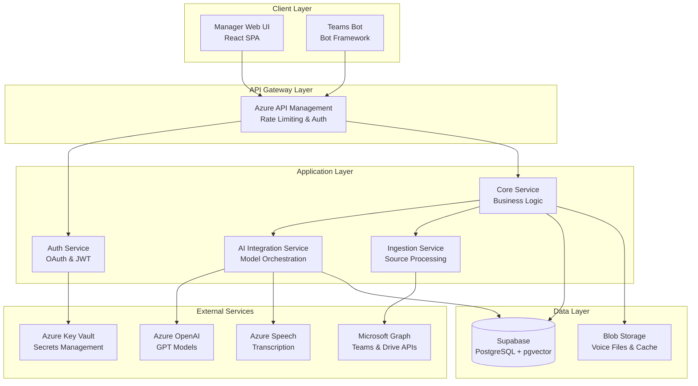

# Design Document

## Overview

GreenBase is designed as a cloud-native AI system built on Azure services, featuring a React web application for managers and a Teams bot for employees. The architecture emphasizes security, scalability, and AI-first workflows with automated content processing, intelligent triaging, and conversational access patterns.

## Architecture

### High-Level Architecture



### Component Responsibilities

- **Manager Web UI**: Source configuration, approval queue management, knowledge base browsing
- **Teams Bot**: Employee interactions for updates and Q&A
- **Auth Service**: OAuth flows, JWT token management, permission validation
- **Core Service**: Business logic orchestration, workflow state management
- **AI Integration Service**: Model interactions, prompt engineering, confidence scoring
- **Ingestion Service**: Source data fetching, PII redaction, content structuring

## Components and Interfaces

### 1. Authentication & Authorization

**OAuth Integration Flow:**
```typescript
interface OAuthConfig {
  provider: 'microsoft' | 'google';
  clientId: string;
  scopes: string[];
  redirectUri: string;
}

interface AccessToken {
  token: string;
  refreshToken: string;
  expiresAt: Date;
  scopes: string[];
}
```

**Security Model:**
- Manager accounts: Full access to their organization's data
- Employee accounts: Read access to approved knowledge base only
- Service-to-service: Managed identities with least privilege
- Data encryption: At rest (Azure Storage) and in transit (TLS 1.3)

### 2. Content Ingestion Pipeline

**Processing Stages:**
1. **Fetch**: Retrieve content from connected sources using stored OAuth tokens
2. **Redact**: Apply PII detection and masking using Azure AI Language services
3. **Structure**: Use GPT-4 to identify topics and create coherent documents
4. **Score**: Apply confidence scoring based on content quality indicators
5. **Queue**: Add to approval queue with metadata and source references

**Data Models:**
```typescript
interface SourceDocument {
  id: string;
  sourceType: 'teams' | 'drive';
  sourceId: string;
  originalContent: string;
  redactedContent: string;
  metadata: {
    author?: string;
    timestamp: Date;
    channel?: string;
    fileName?: string;
  };
}

interface DraftDocument {
  id: string;
  title: string;
  content: string;
  confidenceScore: number;
  triageLevel: 'green' | 'yellow' | 'red';
  sourceDocuments: SourceDocument[];
  status: 'pending' | 'approved' | 'rejected';
}
```

### 3. Smart Approval Queue

**Queue Management:**
- Priority-based processing (Red → Yellow → Green)
- Batch operations for high-confidence items
- Real-time updates using WebSocket connections
- Audit trail for all approval decisions

**Confidence Scoring Algorithm:**
```typescript
interface ConfidenceFactors {
  contentClarity: number;      // 0-1: Readability and structure
  sourceConsistency: number;   // 0-1: Agreement across sources  
  informationDensity: number;  // 0-1: Useful content ratio
  authorityScore: number;      // 0-1: Source credibility
}

function calculateConfidence(factors: ConfidenceFactors): {
  score: number;
  level: 'green' | 'yellow' | 'red';
} {
  const weighted = (
    factors.contentClarity * 0.3 +
    factors.sourceConsistency * 0.3 +
    factors.informationDensity * 0.2 +
    factors.authorityScore * 0.2
  );
  
  return {
    score: weighted,
    level: weighted > 0.8 ? 'green' : weighted > 0.5 ? 'yellow' : 'red'
  };
}
```

### 4. RAG-Powered Q&A System

**Vector Search Implementation:**
- Document chunking: 500-token overlapping segments
- Embedding model: Azure OpenAI text-embedding-ada-002
- Vector store: Supabase PostgreSQL with pgvector extension
- Retrieval: Top-k similarity search using cosine distance with score threshold

**Answer Generation Pipeline:**
```typescript
interface QARequest {
  question: string;
  userId: string;
  context?: string;
}

interface QAResponse {
  answer: string;
  confidence: number;
  sources: DocumentReference[];
  followUpQuestions?: string[];
}

class RAGService {
  async answerQuestion(request: QARequest): Promise<QAResponse> {
    // 1. Embed question
    const questionEmbedding = await this.embedText(request.question);
    
    // 2. Retrieve relevant chunks
    const relevantChunks = await this.vectorSearch(questionEmbedding);
    
    // 3. Generate answer with context
    const answer = await this.generateAnswer(request.question, relevantChunks);
    
    // 4. Extract source references
    const sources = this.extractSources(relevantChunks);
    
    return { answer, sources, confidence: answer.confidence };
  }
}
```

### 5. Teams Bot Interface

**Bot Capabilities:**
- Command handling: `/greenbase update`, `/greenbase ask`
- Voice message processing with Azure Speech Services
- Rich card responses with source links
- Proactive notifications for managers

**Conversation Flow:**
```typescript
interface BotCommand {
  type: 'update' | 'ask' | 'help';
  payload: string | AudioFile;
  userId: string;
  channelId: string;
}

class TeamsBot {
  async handleUpdate(payload: string | AudioFile): Promise<void> {
    const text = payload instanceof AudioFile 
      ? await this.transcribeAudio(payload)
      : payload;
    
    const updateRequest = await this.parseUpdateIntent(text);
    await this.submitToApprovalQueue(updateRequest);
    await this.sendConfirmation();
  }
  
  async handleQuestion(question: string): Promise<void> {
    const response = await this.ragService.answerQuestion({ question });
    await this.sendFormattedAnswer(response);
  }
}
```

## Data Models

### Core Entities

```typescript
// User Management
interface User {
  id: string;
  email: string;
  role: 'manager' | 'employee';
  organizationId: string;
  connectedSources: ConnectedSource[];
}

interface ConnectedSource {
  id: string;
  type: 'teams' | 'google_drive';
  name: string;
  accessToken: string; // Encrypted
  refreshToken: string; // Encrypted
  selectedChannels?: string[];
  selectedFolders?: string[];
  lastSyncAt: Date;
  isActive: boolean;
}

// Knowledge Base
interface ApprovedDocument {
  id: string;
  title: string;
  content: string;
  summary: string;
  tags: string[];
  organizationId: string;
  createdAt: Date;
  updatedAt: Date;
  approvedBy: string;
  version: number;
  sourceReferences: SourceReference[];
}

interface SourceReference {
  sourceType: string;
  sourceId: string;
  url?: string;
  snippet: string;
}

// Version Control
interface DocumentVersion {
  id: string;
  documentId: string;
  version: number;
  content: string;
  changes: string;
  approvedBy: string;
  approvedAt: Date;
}
```

### Database Schema Design

**Supabase Tables:**
- `users` - User accounts and roles (extends Supabase auth.users)
- `organizations` - Tenant isolation with RLS policies
- `connected_sources` - OAuth integrations with encrypted tokens
- `draft_documents` - Approval queue items
- `approved_documents` - Knowledge base content with vector embeddings
- `document_versions` - Change history
- `qa_interactions` - Analytics and learning
- `document_chunks` - Text chunks with pgvector embeddings for RAG

**Vector Storage:**
- Supabase PostgreSQL with pgvector extension for document embeddings
- Vector similarity search with metadata filtering using SQL queries
- Real-time indexing pipeline for approved content using Supabase triggers

## Error Handling

### Error Categories and Responses

1. **Authentication Errors**
   - OAuth token expiration: Automatic refresh with fallback to re-auth
   - Permission denied: Clear error messages with resolution steps
   - Rate limiting: Exponential backoff with user notification

2. **AI Service Errors**
   - Model unavailability: Graceful degradation with cached responses
   - Token limits: Content chunking and batch processing
   - Quality issues: Confidence scoring with human review triggers

3. **Data Processing Errors**
   - PII detection failures: Conservative masking with manual review
   - Ingestion failures: Retry logic with dead letter queues
   - Vector search errors: Fallback to keyword search

4. **User Experience Errors**
   - Bot command failures: Helpful error messages with examples
   - Web UI errors: Toast notifications with retry options
   - Slow responses: Loading states with progress indicators

### Monitoring and Alerting

```typescript
interface ErrorMetrics {
  errorRate: number;
  responseTime: number;
  aiModelLatency: number;
  approvalQueueDepth: number;
  userSatisfactionScore: number;
}

class MonitoringService {
  trackError(error: Error, context: any): void {
    // Log to Azure Application Insights
    // Trigger alerts for critical errors
    // Update health dashboards
  }
  
  trackPerformance(operation: string, duration: number): void {
    // Performance metrics collection
    // SLA monitoring and alerting
  }
}
```

## Testing Strategy

### Testing Pyramid

1. **Unit Tests (70%)**
   - AI service integrations with mocked responses
   - Business logic validation
   - Data model operations
   - Utility functions and helpers

2. **Integration Tests (20%)**
   - API endpoint testing with test databases
   - OAuth flow validation with test accounts
   - Bot command processing end-to-end
   - Vector search accuracy validation

3. **End-to-End Tests (10%)**
   - Complete user workflows from source connection to Q&A
   - Cross-service communication validation
   - Performance testing under load
   - Security penetration testing

### Test Data Strategy

- **Synthetic Data**: Generated test documents with known PII patterns
- **Anonymized Real Data**: Sanitized customer data for realistic testing
- **Edge Cases**: Malformed inputs, extreme content lengths, edge case scenarios
- **Performance Data**: Large document sets for scalability testing

### Quality Assurance

```typescript
interface TestScenario {
  name: string;
  description: string;
  steps: TestStep[];
  expectedOutcome: string;
  actualOutcome?: string;
  status: 'pass' | 'fail' | 'pending';
}

// Example test scenarios
const testScenarios: TestScenario[] = [
  {
    name: "Teams Channel Ingestion",
    description: "Verify complete workflow from Teams connection to approved documents",
    steps: [
      { action: "Connect Teams channel", expected: "OAuth success" },
      { action: "Wait for ingestion", expected: "Documents in approval queue" },
      { action: "Approve documents", expected: "Documents in knowledge base" }
    ],
    expectedOutcome: "All channel messages processed and available for Q&A"
  }
];
```

This design provides a comprehensive foundation for building GreenBase with clear separation of concerns, robust error handling, and scalable architecture patterns optimized for AI workloads.